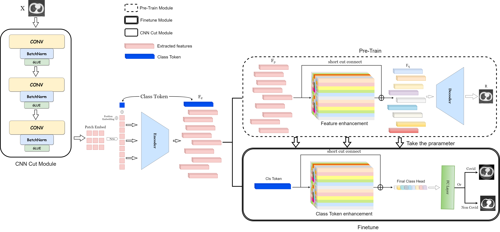

# DeepLearningGit
CCIS
# Abstract
In this paper, we propose a new novel coronavirus pneumonia image classification model based on the combination of Transformer and convolutional network(VQ-ViCNet), and present a vector quantization feature enhancement module for the inconspicuous characteristics of lung medical image data. This model extracts the local latent layer features of the image through the convolutional network, and learns the deep global features of the image data through the Transformer’s multi-head self attention algorithm. After the calculation of convolution and attention, the features learned by the Transformer Encoder are enhanced by the vector quantization feature enhancement module and able to better complete the final downstream tasks. This model performs better than convolutional architectures, pure attention architectures and generative models on all 6 public datasets.

---

